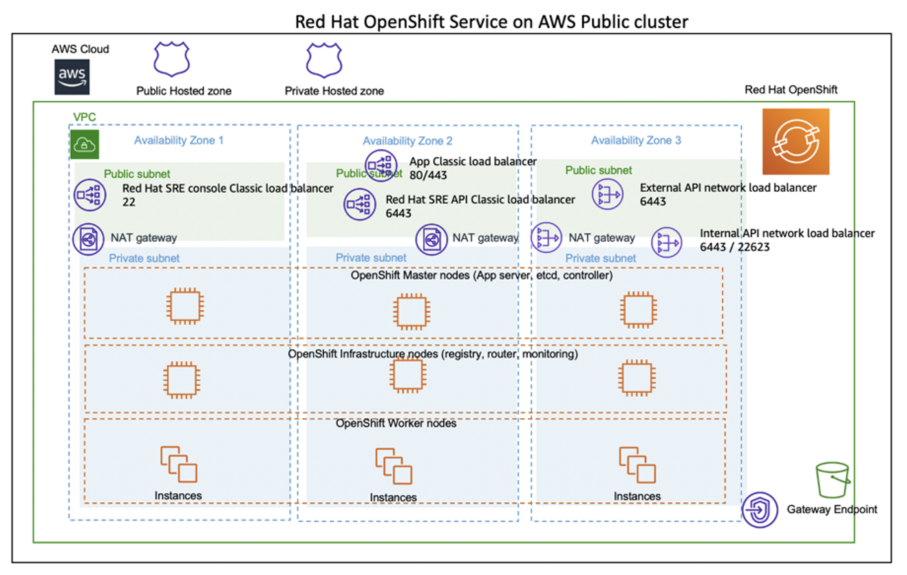
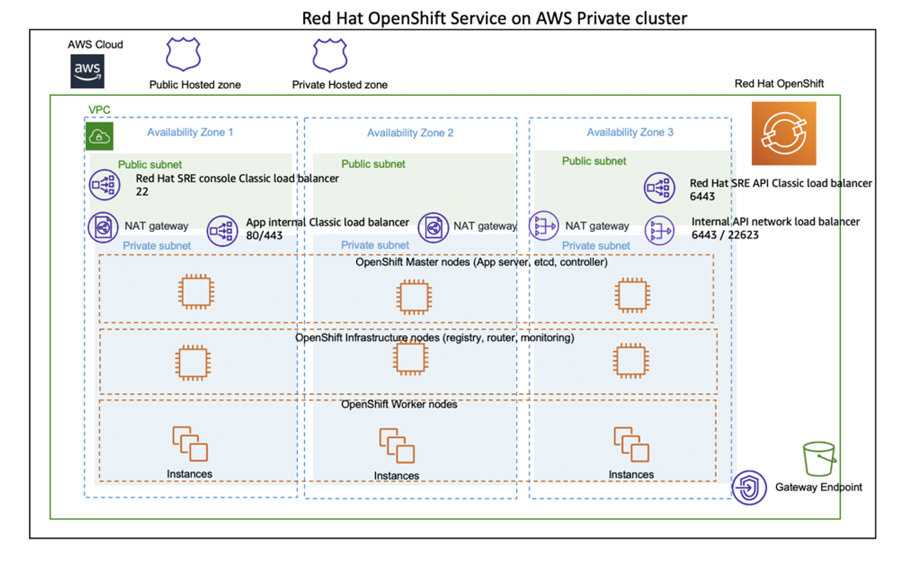
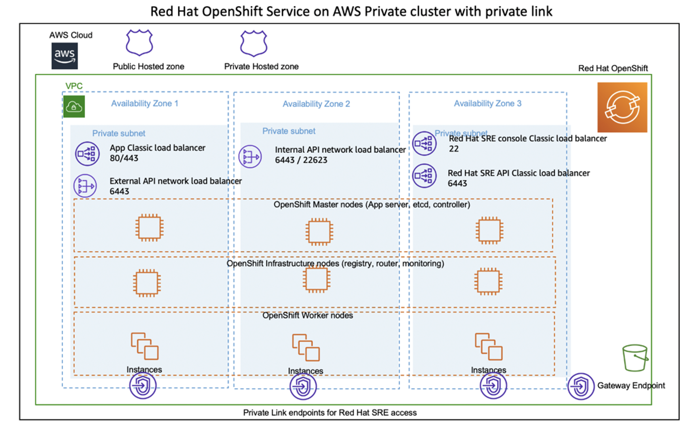

# ROSA Environment Templating Scripts by SOPRASTERIA GROUP

## Deployment Topology:

Deploying this template builds the following openshift cluster from RedHat into a single zone or multi zone.
Here are some differents ways to install the OpenShift Cluster


A public/Private Multi-zone Cluster

A public/private Multi-zone Cluster

A full Airgap (private) Multi-Zone Cluster

The deployment sets up the following as shown in the diagram.
 - A highly available architecture that spans one or three Availability Zones.
 - A VPC configured with public and private subnets according to AWS best practices, to provide you with your own virtual network on AWS.
 - In the public subnets:
   - Managed network address translation (NAT) gateways to allow outbound internet access for resources in the private subnets.
 - In the private subnets:
   - OCP master instances up to three Availability Zones
   - OpenShift Container Platform (OCP) compute nodes.
   - Elastic Block Storage disks that are mounted on the compute nodes for container persistent data.
 - A Classic Load Balancer spanning the public subnets for accessing Cloud Pak for Data from a web browser. Internet traffic to this load balancer is only permitted from ContainerAccessCIDR.
 - A Network Load Balancer spanning the public subnets for accessing the OCP master instances. Internet traffic to this load balancer is only permitted from RemoteAccessCIDR.
 - A Network Load Balancer spanning the private subnets for routing internal OpenShift application programming interface (API) traffic to the OCP master instances.
 - Amazon Route 53 as your public Domain Name System (DNS) for resolving domain names of the IBM Cloud Pak for Data management console and applications deployed on the cluster.

### Prerequisites
* Following modules are required to be installed as prerequisites:
  * Terraform 
  * wget
  * htpasswd
  * python3
  * AWS CLI
  * jq
  * Openshift CLI
  * podman
 
* Alternatively run the below scripts to install all prerequisites:
  * For RHEL:
  ```bash
  ./linux-prereq-install.sh
  ```

  * For Mac:
  ```bash
  ./mac-prereq-install.sh
  ```

### Steps to Deploy:
* AWS `Access key ID` and `Secret access key` will be required for the deployment. Also `AdministratorAccess` policy is required for the IAM user which will be used for deploying the cluster.
* Before deploying the infrastructure make sure you have `python3` installed in your local machine.
* Create a Route 53 domain.
* S3 is the default repository storage for the OpenShift image registry.
* [Download](https://cloud.redhat.com/openshift/install/pull-secret) a pull secret. Create a Red Hat account if you do not have one.

* Clone this repository:
```bash
git clone <repo_url>
```
* Change the current directory to `rosa-deployment`:
```
cd rosa-deployment/
```

If you are using the `example-rosa.tfvars` file, use the following commands to trigger the installation.

```bash
terraform init
terraform apply --var-file=example-rosa.tfvars | tee terraform.log
```

* Optionally you can also edit `variables.tf` and provide values for all the configuration variables. See the [Variables documentation](VARIABLES.md) for more details.  Deploy scripts by executing the following commands

If using the variables.tf file

```bash
terraform init
terraform apply | tee terraform.log
```


#### Openshift installation logs:
After openshift cluster installation is finished, you can check the installation logs as described here: (INSTALLATION-LOG.md)

### Destroying the cluster:
You can use Terraform to destroy the cluster as well.  Please note that this will destroy the entire infrastructure that has been created using the terraform. 
* When cluster created successfully, execute following commands to delete the cluster:
  ```bash
  terraform destroy --var-file="<Path To terraform.tfvars file>"
  ```
* If cluster creation fails, execute following commands to delete the created resources:
  ```bash
  cd installer-files && ./openshift-install destroy cluster
  terraform destroy --var-file="<Path To terraform.tfvars file>"
  ```
### Note:
* For a Private Cluster deployment, you need to deploy from a machine that will be able to connect to the cluster network. This means either from the same network or from a peered network.

